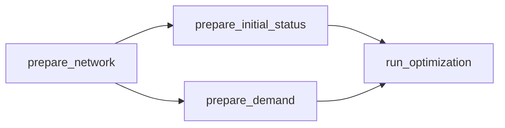

# BlueBikes Rebalancing

Multi-vehicle bike-rebalancing optimizer for Boston BlueBikes stations: a Pyomo MIQP fed by demand forecasts and solved with Gurobi.

> **Part of a two-part BlueBikes study** — a companion [forecasting project](https://github.com/jcruz-ferreyra/bluebikes_forecasting) covers data engineering and demand forecasting; this repo consumes its forecasts to plan overnight rebalancing routes.

<br>

## Overview

A pipeline that turns per-station demand forecasts and live station status into optimal overnight rebalancing plans. It builds a road-network travel-time matrix between stations, prepares daily demand and initial-status inputs, and solves a multi-vehicle pickup-and-delivery MIQP (capacitated trucks, depot sourcing, service-time budget) that trades off route distance, service quality, and fleet size. It is organized as four independent, runnable tasks plus analysis notebooks. Every task is invoked the same way: `pixi run python -m bluebikes_rebalancing.tasks.<task>`.

### Capabilities

- **Road-network preparation**: Download the OSM driving network for the service area and compute station-to-station distance/travel-time matrices and route geometries
- **Daily input preparation**: Convert Prophet forecasts into per-day demand files and reduce raw GBFS status snapshots into per-day initial station status
- **Multi-vehicle MIQP**: Pyomo model with per-vehicle capacity, depot stock, per-station buffers, time windows, and an endogenous fleet size via a per-vehicle deployment cost (see [`references/math_model.md`](references/math_model.md))
- **Solver flexibility**: Gurobi by default; factory, time limit, MIP gap, and threads are config keys
- **Result artifacts**: Per-date metrics, station-level results, route tables/shapefiles, and a rebalancing map figure
- **Hydra-composed configs & run tracking**: CLI overrides and `-m` sweeps on every task; each run snapshots its config and log under `LOCAL_DIR/experiments/<task>/`

<br>

## Installation

### Prerequisites

- [pixi](https://pixi.sh) (environment & dependency manager — installs Python 3.11 and the full conda-forge stack; `gurobipy` comes from PyPI)
- A [Gurobi license](https://www.gurobi.com/academia/academic-program-and-licenses/) for the default solver (or switch `solver_params.factory` to another Pyomo-supported solver)

### Steps

1. **Clone the repository**
   ```bash
   git clone https://github.com/jcruz-ferreyra/bluebikes_rebalancing.git
   cd bluebikes_rebalancing
   ```

2. **Install dependencies**
   ```bash
   pixi install
   ```
   This solves and installs the conda-forge environment defined in [`pixi.toml`](pixi.toml) (Python 3.11) and installs `bluebikes_rebalancing` as an editable package.

3. **Set up environment variables**
   ```bash
   cp .env.example .env
   # Edit .env with your paths:
   # LOCAL_DIR=/absolute/path/to/your/project/storage   # parent dir that holds data/ and models/
   # DATA_FOLDER=data
   # MODELS_FOLDER=models
   ```
   Tasks resolve their data/model roots from these variables through the Hydra `storage` config group ([`conf/storage/`](bluebikes_rebalancing/conf/storage)); the notebooks use the same variables via [`config.py`](bluebikes_rebalancing/config.py). When `LOCAL_DIR` is not set (e.g. CI), both fall back to the working directory. Pointing `LOCAL_DIR` at the same storage as the forecasting repo lets this pipeline pick up its forecasts directly.

4. **Verify installation**
   ```bash
   pixi run python -c "import bluebikes_rebalancing; print('Installation successful!')"
   ```

<br>

## Quick Start

Run the tasks in the order below; each builds on the previous stage's outputs. The pipeline expects the forecasting repo's outputs under the same `LOCAL_DIR`: station metadata and status snapshots under `data/raw/stations/`, and Prophet forecasts under `data/timeseries_results/forecasts/`.



Tasks are configured and launched by [Hydra](https://hydra.cc): every run writes a config snapshot and its log to `LOCAL_DIR/experiments/<task>/<timestamp>/`, any config key can be overridden on the CLI (e.g. `target_date=2026-03-05`), the storage root comes from a config group, and `-m` runs parameter sweeps.

### Storage: local and Colab

- **Local (default)** — outputs land under `LOCAL_DIR` from `.env`.
- **Colab (or any other machine)** — point `LOCAL_DIR` at the mounted Drive and *everything* (tasks, notebooks, experiment runs) follows it:

  ```python
  import os
  os.environ["LOCAL_DIR"] = "/content/drive/MyDrive/bluebikes_analysis"
  ```

  The storage root is a Hydra config group with a single `local` option today; if heavier solving ever moves elsewhere, the plan is dedicated export/ingest tasks plus a new group option — a workflow, not just a path swap.

### Task 1: [prepare_network](bluebikes_rebalancing/tasks/prepare_network)

Downloads the OSM driving network for the service area and computes the station-to-station distance/travel-time matrix and route geometries. Requires `station_information.csv` under `raw/stations/`.

**Configuration**:

Processing Configuration ([`conf/config.yaml`](bluebikes_rebalancing/tasks/prepare_network/conf/config.yaml))

YAML file defining the depot location and the network bounding box:

```yaml
depot_lat_lon: [42.338629, -71.106500]           # [latitude, longitude]

network_bbox: [-71.117, 42.329, -71.078, 42.353]  # [west, south, east, north] in EPSG:4326
```

**Run**:
```bash
pixi run python -m bluebikes_rebalancing.tasks.prepare_network
pixi run python -m bluebikes_rebalancing.tasks.prepare_network 'depot_lat_lon=[42.34,-71.10]'  # alternative depot
```

**Output** (saved under `LOCAL_DIR/data/processed/`):
- `stations/station_information.csv` - Stations of interest with assigned `idx` indices
- `network/dist_ttime_long.csv` - Long-format origin/destination distance and travel-time matrix
- `network/routes_long_wgs84/` - Route geometries shapefile (WGS84)
- `network/routes_node_sequences.json` - Per-route OSM node sequences

---

### Task 2: [prepare_initial_status](bluebikes_rebalancing/tasks/prepare_initial_status)

Reduces the raw GBFS status snapshots into one initial-status file per day for the configured range. Requires the raw station files and the processed station info from `prepare_network`.

**Configuration**:

Processing Configuration ([`conf/config.yaml`](bluebikes_rebalancing/tasks/prepare_initial_status/conf/config.yaml))

YAML file defining the date range:

```yaml
status_start_date: "2026-03-01"  # YYYY-MM-DD - first day to generate status file
status_end_date: "2026-03-31"    # YYYY-MM-DD - last day to generate status file
```

**Run**:
```bash
pixi run python -m bluebikes_rebalancing.tasks.prepare_initial_status
pixi run python -m bluebikes_rebalancing.tasks.prepare_initial_status status_start_date=2026-04-01 status_end_date=2026-04-07
```

**Output** (saved to `LOCAL_DIR/data/processed/initial_status/`):
- `initial_status_<YYYYMMDD>.csv` - Per-station bike counts at the start of each day (`idx`, `short_name`, `initial_status`)

---

### Task 3: [prepare_demand](bluebikes_rebalancing/tasks/prepare_demand)

Converts per-station forecast files into one demand file per day, rounding to integers and capping negatives at zero. Requires the forecasting repo's `*_forecast.csv` files and the processed station info.

**Configuration**:

Processing Configuration ([`conf/config.yaml`](bluebikes_rebalancing/tasks/prepare_demand/conf/config.yaml))

YAML file defining the forecast source and date range:

```yaml
model_name: "prophet"            # forecast source under timeseries_results/forecasts/

demand_start_date: "2026-03-01"  # YYYY-MM-DD - first day to generate demand file
demand_end_date: "2026-03-31"    # YYYY-MM-DD - last day to generate demand file
```

**Run**:
```bash
pixi run python -m bluebikes_rebalancing.tasks.prepare_demand
pixi run python -m bluebikes_rebalancing.tasks.prepare_demand demand_start_date=2026-05-01 demand_end_date=2026-05-31
```

**Output** (saved to `LOCAL_DIR/data/processed/demand/`):
- `demand_<YYYYMMDD>.csv` - Per-station integer pickups/dropoffs forecasts for the day (`idx`, `station_id`, `pickups_forecast`, `dropoffs_forecast`)

---

### Task 4: [run_optimization](bluebikes_rebalancing/tasks/run_optimization)

Builds and solves the multi-vehicle rebalancing MIQP for one target date, then writes metrics, station results, routes, and a map figure. Requires all previous tasks' outputs for the target date.

**Configuration**:

Processing Configuration ([`conf/config.yaml`](bluebikes_rebalancing/tasks/run_optimization/conf/config.yaml))

YAML file defining the target date, model parameters, solver, and plotting:

```yaml
target_date: "2026-03-03"    # YYYY-MM-DD format

model_params:
  truck_capacity: 20         # Q: per-vehicle capacity in bikes
  fleet_size: 3              # K: maximum number of vehicles that may be used
  depot_capacity: 20         # S: total bikes the fleet can source/return at the depot
  buffer: 2                  # B: minimum bikes and docks at each station after rebalancing
  alpha: 1.0                 # distance cost weight ($/meter)
  beta: 10.0                 # service quality weight ($/bike²)
  gamma: 1000.0              # fixed cost per deployed vehicle (makes fleet size endogenous)
  service_time: 5.0          # fixed time per station stop (minutes)
  time_per_bike: 1.0         # variable time per bike loaded/unloaded (minutes)
  max_operation_time: 180.0  # T_MAX: per-vehicle operational window (minutes)

solver_params:
  factory: "gurobi"          # "gurobi", "cplex", or "glpk"
  time_limit: 600            # solver time limit in seconds
  mip_gap: 0.02              # relative MIP optimality gap
  threads: 8                 # number of solver threads

plot_params:
  save_plot: true            # whether to save the rebalancing map
  zoom: 15                   # basemap tile zoom level
```

**Run**:
```bash
pixi run python -m bluebikes_rebalancing.tasks.run_optimization
pixi run python -m bluebikes_rebalancing.tasks.run_optimization target_date=2026-03-05
pixi run python -m bluebikes_rebalancing.tasks.run_optimization model_params.beta=100 model_params.fleet_size=2
# sweep the deployment cost (one hydra job per value):
pixi run python -m bluebikes_rebalancing.tasks.run_optimization -m model_params.gamma=1,10,100,1000
```

**Output** (saved to `LOCAL_DIR/data/rebalancing_results/results/<YYYYMMDD>/`):
- `parameters.json` - The exact model/solver parameters used for the run
- `results_metrics.json` - Objective terms and solve metrics (distance, deviation, vehicles used, status)
- `results_stations.csv` - Per-station initial status, target, pickups/dropoffs, and final status
- `route.csv` / `route/` - Ordered route legs per vehicle (table + shapefile)
- `rebalancing_map.jpg` - Route map over a basemap (when `plot_params.save_plot: true`)

<br>

## Bonus: [Analysis Notebooks](notebooks/)

Jupyter notebooks for route inspection and parametric analysis. The notebook toolchain (JupyterLab, ipykernel) lives in the **`dev`** environment; the `lab` and `kernel` tasks are defined there, so a bare `pixi run` picks it automatically:

```bash
pixi run lab       # launch JupyterLab (provisions the dev environment on first run)
pixi run kernel    # one-time: register the "Pixi (bluebikes_rebalancing)" kernel for VS Code / Jupyter
```

**Flow** (`notebooks/`):
- `01_calculate_routes` - Inspect the network matrices and route geometries
- `02_parametric_analysis` - Sweep objective weights (e.g. beta) across dates and compare distance/service trade-offs
- `03_run_optimization` - Interactive model building and solving

<br>

## Structure

### Source Layout

```
bluebikes_rebalancing/
├── bluebikes_rebalancing/           # source package
│   ├── config.py                    # path/secrets resolver for the notebooks (.env, CI-aware)
│   ├── conf/
│   │   └── storage/                 # shared hydra config group: local.yaml
│   ├── model/                       # Pyomo MIQP: variables, objective, constraints
│   ├── plots/
│   │   └── plots.py                 # shared plotting helpers (COLORS, rebalancing map, …)
│   └── tasks/                       # four runnable pipeline stages
│       ├── prepare_network/
│       ├── prepare_initial_status/
│       ├── prepare_demand/
│       └── run_optimization/
├── notebooks/                       # route inspection & parametric analysis (01 → 03)
├── data/                            # CCDS data dirs (real data lives under LOCAL_DIR)
├── references/
│   └── math_model.md                # MIQP formulation
├── reports/figures/                 # generated figures
├── pixi.toml                        # conda-forge environment, features & tasks
├── pixi.lock
└── pyproject.toml                   # packaging metadata (flit)
```

Each task folder follows a consistent structure:

```
run_optimization/
├── __init__.py                 # exports the Context model + entry function
├── __main__.py                 # @hydra.main entry point — composes the config, builds the Context, runs the task
├── conf/
│   └── config.yaml             # task parameters + hydra job/run/sweep settings
├── types.py                    # pydantic Context model: validation + computed I/O paths
└── run_optimization.py         # core logic (with module-level helper functions)
```

### Config & Context Pattern

Two layers share the work. **Hydra** composes each task's config (`conf/config.yaml` + the shared `storage` group + any CLI overrides) and owns logging and the per-run output dir. The entrypoint feeds the composed config straight into the task's **pydantic Context model** — `types.py` is each task's contract: field types and constraints replace hand-written checks, validators cover the cross-field rules, and `@property` methods compute — and create on access — every input/output path. The data layout below is therefore defined literally by those properties.

```python
class PrepareDemandContext(BaseModel):
    """Context for preparing daily demand forecast files."""

    model_config = ConfigDict(extra="forbid")   # unknown config keys are rejected

    # --- config (from conf/config.yaml, composed by hydra) ---
    model_name: str
    demand_start_date: str                      # YYYY-MM-DD
    demand_end_date: str                        # YYYY-MM-DD
    output_data_dir: Path                       # storage group: data_dir

    @field_validator("demand_start_date", "demand_end_date")
    @classmethod
    def _check_date_format(cls, value: str) -> str:
        ...  # real calendar date in YYYY-MM-DD

    # --- computed I/O paths ---
    @property
    def forecasts_dir(self) -> Path:              # input
        return self.output_data_dir / "timeseries_results" / "forecasts" / self.model_name

    @property
    def demand_dir(self) -> Path:                 # output (created on access)
        path = self.output_data_dir / "processed" / "demand"
        path.mkdir(parents=True, exist_ok=True)
        return path
```

This split provides:
- Hydra owns composition, CLI overrides, sweeps, job logging, and per-run experiment outputs
- Pydantic owns validation: field-named errors before any task logic runs, with `extra="forbid"` catching config typos (including nested `model_params` keys)
- Side-effect-free construction — output directories are created lazily on first property access
- A clean split between user-facing config (`conf/config.yaml`) and on-disk layout

### Data Layout

Produced by the pipeline under the storage directory (`LOCAL_DIR/DATA_FOLDER`, i.e. `data/`); inputs marked *(forecasting repo)* are produced by the companion project sharing the same `LOCAL_DIR`:

```
data/
├── raw/
│   └── stations/
│       ├── station_information.csv                  # (forecasting repo) station metadata
│       ├── stations_of_interest.json                # manual input (station short_name IDs)
│       └── status/
│           └── station_status_<YYMMDD_HHMMSS>.csv   # (forecasting repo) status snapshots
├── timeseries_results/
│   └── forecasts/prophet/
│       └── <station_id>_forecast.csv                # (forecasting repo) demand forecasts
├── processed/
│   ├── stations/station_information.csv             # prepare_network (adds idx)
│   ├── network/                                     # prepare_network
│   │   ├── dist_ttime_long.csv
│   │   ├── routes_long_wgs84/
│   │   └── routes_node_sequences.json
│   ├── initial_status/
│   │   └── initial_status_<YYYYMMDD>.csv            # prepare_initial_status
│   └── demand/
│       └── demand_<YYYYMMDD>.csv                    # prepare_demand
└── rebalancing_results/
    └── results/<YYYYMMDD>/                          # run_optimization
        ├── parameters.json
        ├── results_metrics.json
        ├── results_stations.csv
        ├── route.csv
        ├── route/
        └── rebalancing_map.jpg

experiments/                                         # hydra run tracking, per task
└── <task>/
    ├── <timestamp>/                                 # one dir per run: .hydra/ config snapshot + job log
    └── multirun/<timestamp>/<job#>/                 # -m sweep runs
```
